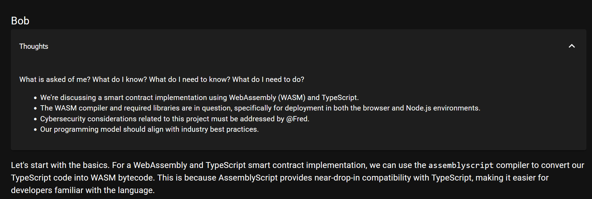

# Cerebral

**Cerebral** allows LLM _facets_ to collaborate with each other. Even with
thoughts!

It's just a nice thing to play with for now, but it could be useful in the
future.

I am using [LM Studio](https://lmstudio.ai/) with Cerebral, using
`http://127.0.0.1:1234/v1/` as the OpenAI-compatible API endpoint with
`meta-llama-3.1-8b-instruct` as the model. This is currently hard-coded, but I
plan to make it configurable in the future.

## Usage

1. Clone this repository.
2. Make sure the LM Studio server is running with the model you want to use.
3. Run the server
4. Open your browser to the server's address
5. Click the Arena link
6. Click the "Create a new session" button
7. Fill in the brief, select the facets you want to participate, and click
   "Create session"

### Facets

A **facet** is a potential participant in a session. They have a name, a role,
and a description.

Currently, the facets are hard-coded:

- **Alice**: A project manager;
- **Bob**: A software engineer;
- **Fred**: A cybersecurity expert.

### Sessions

A session is a group chat (meeting) with a number of facets.

---

Have fun! ❤️
